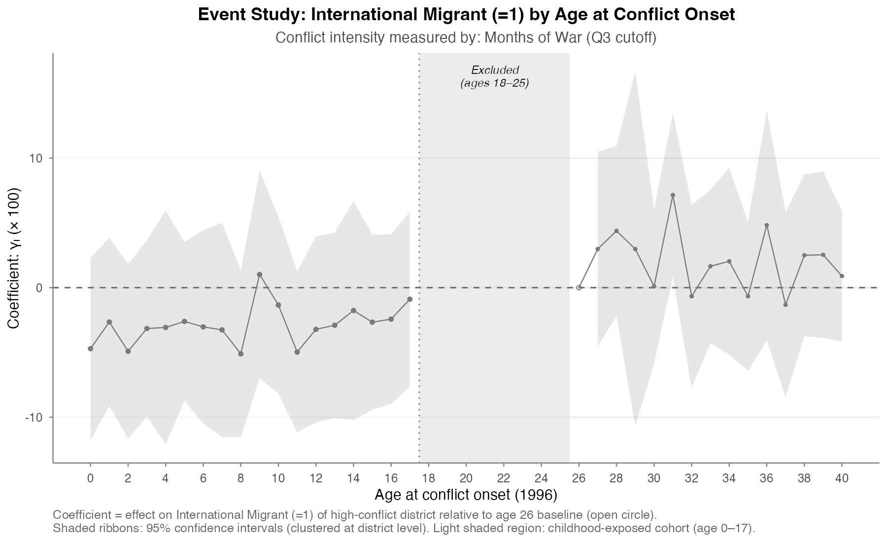

# Motivation {.section-title}

## A central question in development economics

Civil conflict reshapes household behavior — but for how long, and through what channels?

- Most research focuses on **contemporaneous** effects: schooling, labor, displacement during conflict
- Less is known about how **childhood exposure** to conflict affects long-run economic decisions
- **International migration** is one of the most consequential long-run decisions in low-income contexts

::: {.notes}
Speaker notes go here. They appear in presenter mode (press 'S' during the presentation) but never in the slides themselves.
:::

## Why Nepal, and why migration?

::: {.columns}

::: {.column width="50%"}
**Nepal's civil war (1996–2006)**

- Decade-long Maoist insurgency
- Spatially uneven — heavily affected mid-western and far-western districts
- Over 17,000 fatalities; ~100,000 displaced
:::

::: {.column width="50%"}
**Migration as long-run outcome**

- Nepal is one of the world's most remittance-dependent countries (~25% of GDP)
- International migration: Gulf states, Malaysia, India
- Decisions made by working-age adults *who were children during conflict*
:::

:::

## What this paper does

1. **Identifies the long-run effect** of childhood conflict exposure on international migration
2. Uses a **difference-in-differences** design exploiting variation in conflict intensity (across districts) and age at conflict onset (across cohorts)
3. **Tests the parallel trends assumption** through a Duflo-style event study

# Data and Setting {.section-title}

## Data sources

::: {.columns}

::: {.column width="50%"}
**Nepal Labour Force Survey 2017/18**

- ~90,000 individuals
- Migration outcomes (international, internal, return migrant)
- Demographics, ethnicity, education
- District identifiers
:::

::: {.column width="50%"}
**INSEC conflict database (1996–2006)**

- District-level monthly counts of:
  - Violent incidents
  - Casualties (combatant and civilian)
- Aggregated to **months of war** and **total casualties** by district
:::

:::

## Sample construction

<iframe src="../Paper/Tables/Tables_Summary/2.Sample_Construction.html" width="100%" height="500" style="border: none;"></iframe>

Final analysis sample: **37,174 individuals** in 75 districts.

::: {.notes}
Walk through the panel structure:
- Panel A: dropping observations missing district
- Panel B: cohort exclusions
- Panel C: final estimation sample (Treatment + Control)
Mention the deliberate exclusion of ages 18–25 at conflict onset.
:::

## Defining cohorts and conflict intensity

::: {.columns}

::: {.column width="50%"}
**Treatment cohort**: aged 0–17 at conflict onset (1996)

- Currently 18–45 in NLSS 2017/18
- Childhood-exposed to civil war
:::

::: {.column width="50%"}
**Control cohort**: aged 26–40 at conflict onset

- Currently 47–65 in NLSS
- Already adults during conflict; not childhood-exposed
:::

:::

**High-Conflict districts** (two definitions):

- Above 75th percentile of **months of war** (1996–2006)
- Above 75th percentile of **total casualties** (1996–2006)

# Identification Strategy {.section-title}

## Difference-in-differences design

For individual $i$ in district $d$ of age $k$:

$$
Y_{idk} = c_{1} + \alpha_{d} + \beta_{k} + (P_d \times T_i)\gamma + \mathbf{X}_i' \delta  + \varepsilon_{idk}
$$

- $T_i$ = 1 if individual was 0–17 at conflict onset (treatment cohort)
- $P_d$ = 1 if district above the conflict-intensity threshold (above 75^th^ percentile) 
- $\alpha_d$ = district fixed effects; $\beta_k$ = age fixed effects
- $\gamma$ is the **DiD coefficient** of interest
- Standard errors clustered at the district level

## Identification builds on Duflo (2001)

Two sources of variation power identification:

1. **Cross-district**: high vs. low conflict intensity
2. **Cross-cohort**: people who were children vs. adults during the conflict

Treatment is most plausibly exogenous *given* the FE — comparing siblings of effectively the same age, in different conflict regimes, after district-level confounders are absorbed.

# Descriptive Evidence {.section-title}

## Table 6 — Means by cohort and conflict intensity

<iframe src="../Paper/Tables/Tables_Summary/6.DiD_Two_Measures.html" width="100%" height="520" style="border: none;"></iframe>

::: {.notes}
Walk through one panel — say International Migrant — and show how the four corner means produce the DiD estimate of −4.8.
Stress that:
- The placebo direction (control cohort positive H–L gap) is what makes the DiD negative
- Robust across both measures
:::

## Reading the DiD bottom-right cells

- **Panel A (International Migrant)**: −4.80*** (Months) and −6.05*** (Casualties)
- **Panel B (Currently Abroad)**: −3.52*** (Months) and −4.51*** (Casualties)
- **Panel C (Return Migrant)**: −1.45 (Months) and −1.79*** (Casualties)
- **Panel D (Internal Migration)**: 1.05 (Months) and 0.97 (Casualties) — both insignificant

The pattern is consistent: childhood conflict exposure *suppresses* international migration, with no effect on internal migration.

# Main Regression Results {.section-title}

## Table 7a — International Migrant

<iframe src="../Paper/Tables/Tables_Main/7a.DiD_Regression.html" width="100%" height="520" style="border: none;"></iframe>

The coefficient is **stable across specifications** as we add demographic controls and fixed effects, supporting a causal interpretation.

## Stable across specifications, stable across measures

Adding district FE, age FE, and demographic controls **strengthens** the estimate slightly:

- Column (1) raw OLS: −4.80***
- Column (4) full specification: −5.04***

This stability is reassuring — the coefficient isn't being driven by any one source of variation.

## Sub-Cohort Impacts

# Event Study Evidence {.section-title}

## Duflo-style event study (Equation 2)

For each age $\ell$ at conflict onset, estimate:

$$
Y_{ijk} = \alpha + \delta_d + \tau_a + \sum_{\ell \neq 26} \gamma_\ell \cdot (P_j \times \mathbb{1}[\text{age}_i = \ell]) + \varepsilon_{ijk}
$$

The coefficient $\gamma_\ell$ traces out the **dose-response curve** across ages.

- Treated ages (0–17): expected to be negative if conflict suppresses migration
- Placebo ages (26–40): expected to be near zero (parallel trends)

## Event study figure: International Migration × Months of War

{fig-align="center" width=85%}

::: {.notes}
Two key things to point out:
1. Placebo region (ages 26-40): coefficients hover around zero with wide CIs — supports parallel trends
2. Treated region (ages 0-17): EVERY coefficient is negative, clustering around -3 to -5 pp
3. The flat shape across ages 0-17 suggests household/district-level mechanism rather than developmental window-specific effects
:::

## Interpreting the flat negative pattern

Across all 18 childhood ages, coefficients are negative — the effect is **broad-based**, not concentrated in a specific developmental window.

::: {.columns}

::: {.column width="50%"}
**Mechanisms that fit this pattern:**

- Household wealth destruction
- Migration network disruption
- District-level economic damage
:::

::: {.column width="50%"}
**Mechanisms that don't fit:**

- Cohort-specific schooling shocks
- Early-childhood developmental shocks alone
- Adolescent conscription effects
:::

:::

# Robustness and Heterogeneity {.section-title}

## Robustness checks (planned)

1. Alternative conflict intensity measures (continuous, casualty-based)
2. Alternative sample restrictions (varying age windows)
3. Placebo regressions on cohorts not exposed
4. Permutation tests on conflict intensity assignment

## Heterogeneity (planned)

- By **household wealth** at survey time → tests resource constraint story
- By **district remoteness** → tests network/access story
- By **ethnic group** → tests selection into migration channels
- By **gender** → tests differential exposure mechanisms

# Discussion {.section-title}

## What we learn

::: {.incremental}
- Childhood exposure to civil conflict **substantially reduces** later international migration
- Effect is large: ~5 pp on a baseline migration rate of ~22%
- Effect is **not** concentrated in any specific developmental window
- Suggests mechanisms operating at household or district level — not biological/developmental
:::

## Limitations

- Cannot directly observe the household wealth channel
- District-level shock is correlated with many things; clean mechanism identification requires further data
- Survey is cross-sectional (NLSS 2017/18); longitudinal version would strengthen the design

## Next steps

1. Add casualty-based event study (Figure 8b)
2. Build heterogeneity tables by household wealth and district remoteness
3. Mechanism analysis using continuous conflict intensity
4. Compare with my second paper (1988 earthquake → labor markets)

# Thank you {.section-title}

::: {.center}

Comments, questions, suggestions:

**Ramesh Dulal**
ramesh.dulal@ou.edu

:::

::: {.notes}
Key things to be ready for in Q&A:
- Why exclude ages 18-25? (Avoid contamination of childhood vs adult exposure)
- Parallel trends defense (placebo region in event study)
- Mechanism uncertainty (acknowledge this is descriptive)
- Comparison to other Nepal conflict studies (Valente 2014, Menon & van der Meulen Rodgers 2011)
:::
